# HopeGait AI Agent — Synthetic FoG Dataset Generator

A multi-step AI Agent workflow that uses Google Gemini to *parameterize* a
deterministic Python signal synthesizer, producing extra Freezing-of-Gait
training data in the same `.npy` layout `src/data_pipeline/preprocess.py`
writes — drop-in for `dataset.py` and `train.py`. Real Stanford NMBL
recordings cover only ~10 FoG-positive subjects, so a synthetic supplement
helps the LOSO-trained TCN see broader severity / gait-frequency / tremor-band
diversity during training.

The agent makes **5 paced Gemini calls per run** and stays inside the Google
AI Studio free tier without server-side rejections. It also satisfies the
proof-of-use evidence requirement for the **Xiaomi MiMo Orbit 100T Token
Grant** (window: Apr 28 – May 28, 2026): every push to `main` triggers a CI
run, and the timestamped Markdown report is uploaded as an artifact for
30-day retention.

> **Synthetic-data caveat.** Mix-in only (e.g. 1:1 or 1:2 with real data),
> never the sole training source for clinical claims. See the LIMITATIONS
> section in the dataset card written by call #5.

## Pipeline

```mermaid
flowchart LR
    G1["Gemini #1<br/>20 clinical profiles<br/>NFOG-Q, H&Y"]
    G2["Gemini #2<br/>per-subject event<br/>timelines (walk/FoG)"]
    S1["Local synthesis<br/>numpy/scipy<br/>gait + freeze + tremor + noise"]
    G3["Gemini #3 QC<br/>review per-subject stats<br/>propose corrections (JSON)"]
    S2["Local re-synth<br/>apply parameter<br/>corrections"]
    G4["Gemini #4<br/>augmentation strategy<br/>rotation / shift / noise / dropout"]
    G5["Gemini #5<br/>dataset card + LOSO split<br/>(Datasheets-for-Datasets)"]
    DSP["DSP split + 0.3 Hz lowpass<br/>→ 9 channels, 128-sample windows<br/>save .npy"]
    R["reports/<br/>YYYY-MM-DD_synth_run.md"]

    G1 --> G2 --> S1 --> G3 --> S2 --> G4 --> G5 --> DSP --> R

    classDef llm fill:#e8f0ff,stroke:#3b6ea8,color:#1a1a1a;
    classDef local fill:#eef7ec,stroke:#3f8f4a,color:#1a1a1a;
    class G1,G2,G3,G4,G5 llm;
    class S1,S2,DSP,R local;
```



The numerical waveform synthesis (`agent/synth_signal.py`) is fully
deterministic and grounded in the FoG biomarker literature (Moore-Bachlin
Freeze Index, gait/tremor frequency bands, NFOG-Q severity). The LLM never
produces raw waveforms — it only sets the parameters.

## Local run

```bash
export GOOGLE_API_KEY=<your-key>
pip install -r agent/requirements.txt
python agent/hopegait_agent.py
```

A successful run prints 9 step panels, 5 Gemini call latencies and token
counts, a per-subject QC stats summary, and an `=== AGENT RUN COMPLETE ===`
panel with totals. Outputs:

- `data/synthetic/win_128/subj_S<id>_synth_x.npy` — shape `(N, 128, 9)` float32
- `data/synthetic/win_128/subj_S<id>_synth_y.npy` — shape `(N, 128)` int64
- `data/synthetic/win_128/DATASET_CARD.md` — Gemini-written dataset card
- `reports/YYYY-MM-DD_HH-MM-SS_synth_run.md` — full Markdown run report

The 9-channel layout matches `src/data_pipeline/preprocess.py` bit-for-bit
(`linear_acc[3] + gravity[3] + gyro[3]` after a 0.3 Hz Butterworth lowpass
split), so the existing `dataset.py` LOSO loader picks the synthetic
subjects up alongside any real recordings without code changes.

## Google AI Studio free-tier usage

Both `gemini-3-flash-preview` (primary) and `gemini-3.1-flash-lite-preview`
(fallback) currently expose free tiers in the Gemini API. Google no longer
publishes static per-model free-tier numbers — live RPM/TPM/RPD for your
project are shown on the **AI Studio → Rate limits** page, and Google's
docs note that "specified rate limits are not guaranteed and actual
capacity may vary." Always confirm there before a fresh run.

The agent makes 5 paced LLM calls per run, which is well inside any
reasonable preview-tier budget for either model.

Pacing is enforced locally in `gemini_call()`: each call waits until
`MIN_CALL_INTERVAL_S = 12.5` s have elapsed since the last successful call
(i.e. ≤ 5 RPM with margin), so a single agent run never bursts past the
RPM ceiling and never earns a 429 from request rate alone. If
`gemini-3-flash-preview` returns an `APIError`, the call retries once
after 2 s, then falls back to `gemini-3.1-flash-lite-preview`, so a
transient outage on the primary model degrades gracefully rather than
killing the run.

`MAX_OUTPUT_TOKENS = 8192` per call keeps responses long enough to be
useful in chained context for later calls, while staying inside the
per-request budget on either model.

## GitHub Actions

The workflow at `.github/workflows/hopegait_agent.yml` triggers on:
- push to `main`
- pull requests targeting `main`
- manual dispatch (`workflow_dispatch`)

It runs the agent, then a CPU-only smoke job that points
`HOPEGAIT_PROCESSED_DATA_DIR=data/synthetic` at the fresh pool, auto-picks
the first synthetic subject, and runs
`src/training/train.py --window 128 --subject <auto> --epochs 2 --no-amp --device cpu`
followed by `src/training/evaluate.py`. Two artifacts are uploaded:

- `hopegait-agent-report` — `reports/` markdown (30-day retention)
- `hopegait-synth-smoke` — `data/synthetic/` + `models/` checkpoint and metrics (14-day retention)

The smoke job is a *plumbing test* — it proves the agent's `.npy` layout
still loads cleanly into `dataset.py` and that the training graph runs
end-to-end. It is **not** a production checkpoint: training is CPU-only,
two epochs, synthetic-only. The real training run happens on a GPU box
via `scripts/launch_cloud.sh` after copying or symlinking the synthetic
files into `data/processed/win_128/`.

**Required repo secret:** `GOOGLE_API_KEY` — add it at
**GitHub repo → Settings → Secrets and variables → Actions → New repository
secret**.

## Get a free API key

https://aistudio.google.com/apikey — sign in with a Google account. The
free tier currently includes `gemini-3-flash-preview` and
`gemini-3.1-flash-lite-preview`; check the AI Studio rate-limits page for
the live RPM / TPM / RPD numbers on your project.

## Dataset spec (matches upstream)

The 6-channel raw layout, units, and sample rates are aligned with the
upstream
[stanfordnmbl/imu-fog-detection](https://github.com/stanfordnmbl/imu-fog-detection)
dataset:

| Setting | Value | Source |
|---|---|---|
| Raw channels | `ax, ay, az, gx, gy, gz` | dataset README |
| Accel units | m/s² | dataset README |
| Gyro units | rad/s | dataset README |
| `FREQ_SAMPLED` | 128 Hz | `code/datapreprocessing.py` |
| `FREQ_DESIRED` | 64 Hz | `code/datapreprocessing.py` |
| `WINDOW_DUR` | 2 s | `code/datapreprocessing.py` |
| Window length | 128 samples (at 64 Hz) | `WINDOW_DUR * FREQ_DESIRED` |
| Model channels | 9 (linear_acc + gravity + gyro) | `src/data_pipeline/dsp.py` |

The synthesizer emits 6 channels at 64 Hz; `IMUFilter.process_signal()`
from `src/data_pipeline/dsp.py` performs the 0.3 Hz Butterworth lowpass
split into linear_acc + gravity, after which the model sees 9 channels.

## Token usage

A typical run lands around 100K–250K total tokens across the 5 calls,
driven by chained prior-call context inside calls 3, 4, and 5. Wall-clock
runtime is roughly 2–4 minutes (dominated by the 12.5 s spacing between
calls).

## Files

| Path | Purpose |
|---|---|
| `agent/hopegait_agent.py` | 9-step orchestrator, 5 Gemini calls |
| `agent/synth_signal.py` | Deterministic numpy/scipy IMU synthesizer |
| `agent/requirements.txt` | Pinned deps (separate from project deps) |
| `agent/README.md` | This file |
| `.github/workflows/hopegait_agent.yml` | CI workflow |
| `data/synthetic/win_128/` | Generated `.npy` subjects + DATASET_CARD.md |
| `reports/` | Timestamped run reports (artifact-uploaded) |

## Note on architecture grounding

The Gemini prompts include a project-context blob that names the actual
HopeGait architecture (causal TCN with channel progression
`(32, 64, 96, 128)` and dilations `1/2/4/8`, receptive field ≈ 0.95 s at
64 Hz, TimeWiseLayerNorm, CausalSqueezeExcite1d, dual-head, focal-loss
γ=2.0) and the literature anchors (Moore-Bachlin FI, NFOG-Q, Hoehn & Yahr).
This keeps the LLM's parameter choices clinically plausible rather than
generic.